# How to Connect Different Kinds of Electrical Switches 开关接线图

<!-- START doctoc generated TOC please keep comment here to allow auto update -->
<!-- DON'T EDIT THIS SECTION, INSTEAD RE-RUN doctoc TO UPDATE -->
**Table of Contents** 

- [一开单控接线图](#%E4%B8%80%E5%BC%80%E5%8D%95%E6%8E%A7%E6%8E%A5%E7%BA%BF%E5%9B%BE)
- [二、三开连体单控接线图](#%E4%BA%8C%E4%B8%89%E5%BC%80%E8%BF%9E%E4%BD%93%E5%8D%95%E6%8E%A7%E6%8E%A5%E7%BA%BF%E5%9B%BE)
- [四开连体单控接线图](#%E5%9B%9B%E5%BC%80%E8%BF%9E%E4%BD%93%E5%8D%95%E6%8E%A7%E6%8E%A5%E7%BA%BF%E5%9B%BE)
- [一开五孔单控插座接线图（开关控制插座）](#%E4%B8%80%E5%BC%80%E4%BA%94%E5%AD%94%E5%8D%95%E6%8E%A7%E6%8F%92%E5%BA%A7%E6%8E%A5%E7%BA%BF%E5%9B%BE%E5%BC%80%E5%85%B3%E6%8E%A7%E5%88%B6%E6%8F%92%E5%BA%A7)
- [二开五孔单控插座接线图](#%E4%BA%8C%E5%BC%80%E4%BA%94%E5%AD%94%E5%8D%95%E6%8E%A7%E6%8F%92%E5%BA%A7%E6%8E%A5%E7%BA%BF%E5%9B%BE)
- [一开双控接线图](#%E4%B8%80%E5%BC%80%E5%8F%8C%E6%8E%A7%E6%8E%A5%E7%BA%BF%E5%9B%BE)
- [二、三开单控接线图](#%E4%BA%8C%E4%B8%89%E5%BC%80%E5%8D%95%E6%8E%A7%E6%8E%A5%E7%BA%BF%E5%9B%BE)
- [四开单控接线图](#%E5%9B%9B%E5%BC%80%E5%8D%95%E6%8E%A7%E6%8E%A5%E7%BA%BF%E5%9B%BE)
- [一开五孔单控接线图（开关控制灯泡）](#%E4%B8%80%E5%BC%80%E4%BA%94%E5%AD%94%E5%8D%95%E6%8E%A7%E6%8E%A5%E7%BA%BF%E5%9B%BE%E5%BC%80%E5%85%B3%E6%8E%A7%E5%88%B6%E7%81%AF%E6%B3%A1)
- [二\三开双控接线图](#%E4%BA%8C%5C%E4%B8%89%E5%BC%80%E5%8F%8C%E6%8E%A7%E6%8E%A5%E7%BA%BF%E5%9B%BE)
- [一开多控接线图](#%E4%B8%80%E5%BC%80%E5%A4%9A%E6%8E%A7%E6%8E%A5%E7%BA%BF%E5%9B%BE)
- [两开多控接线图](#%E4%B8%A4%E5%BC%80%E5%A4%9A%E6%8E%A7%E6%8E%A5%E7%BA%BF%E5%9B%BE)
- [三开多控接线图](#%E4%B8%89%E5%BC%80%E5%A4%9A%E6%8E%A7%E6%8E%A5%E7%BA%BF%E5%9B%BE)

<!-- END doctoc generated TOC please keep comment here to allow auto update -->

## 一开单控接线图

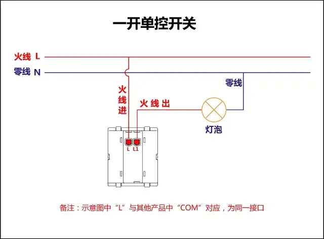

## 二、三开连体单控接线图

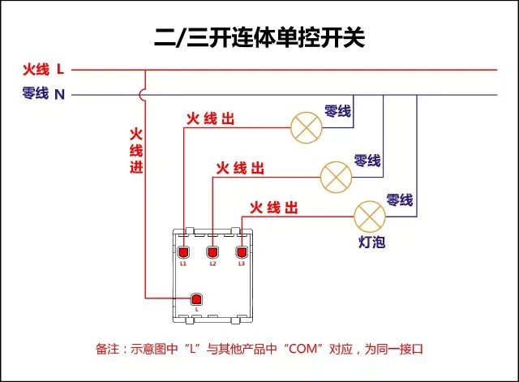

## 四开连体单控接线图

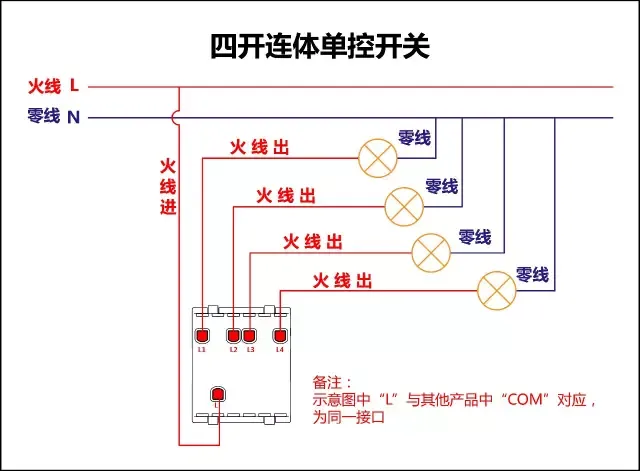

## 一开五孔单控插座接线图（开关控制插座）

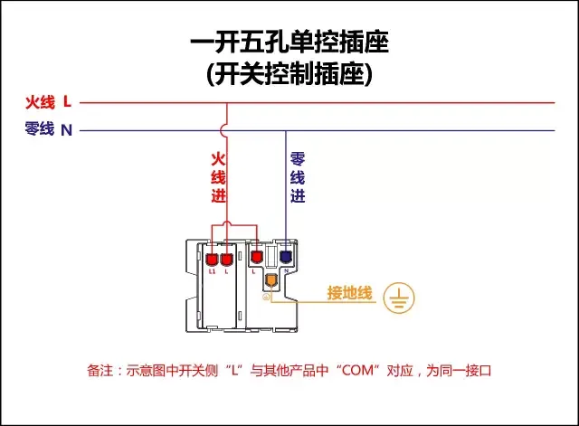

## 二开五孔单控插座接线图

## 一开双控接线图

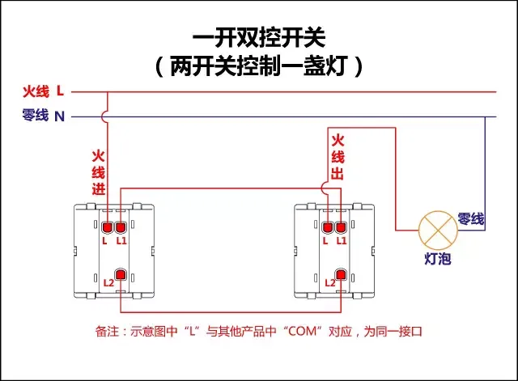

以下为单开双控开关3种接法原理图，不推荐第三种接法，开关控制在零线上，存在安全隐患

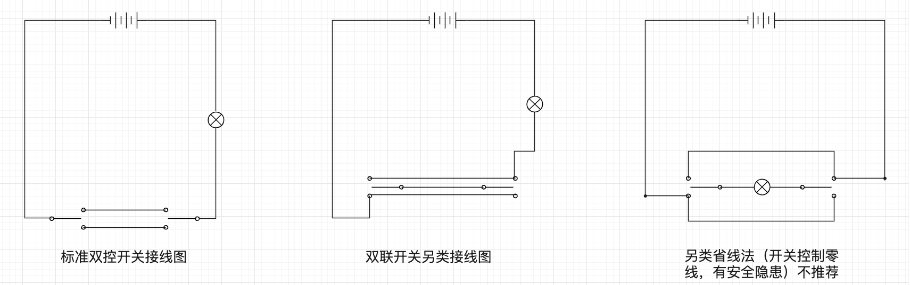

## 二、三开单控接线图

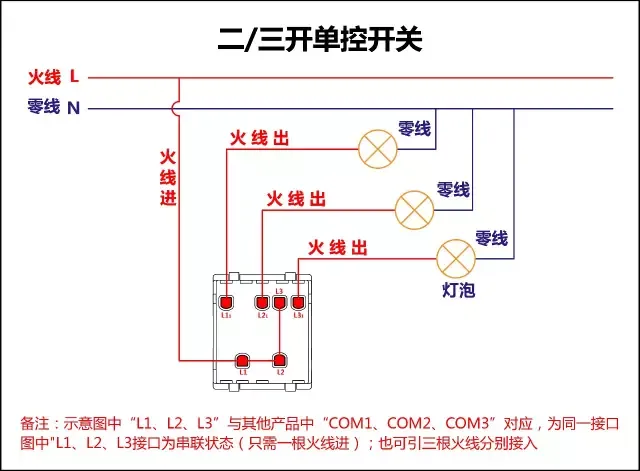

## 四开单控接线图

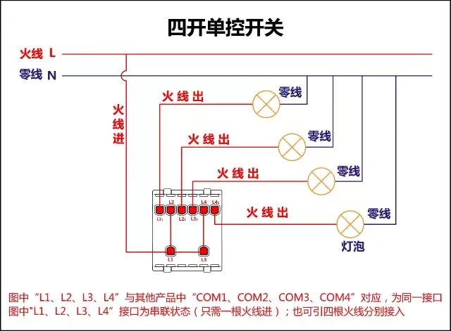

## 一开五孔单控接线图（开关控制灯泡）

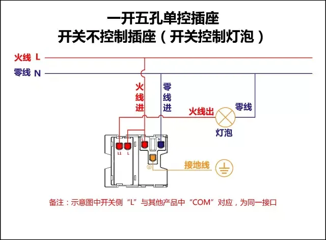

## 二\三开双控接线图

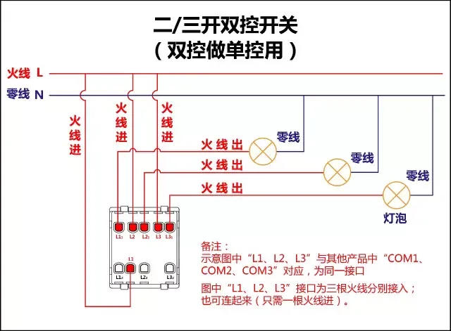

## 一开多控接线图

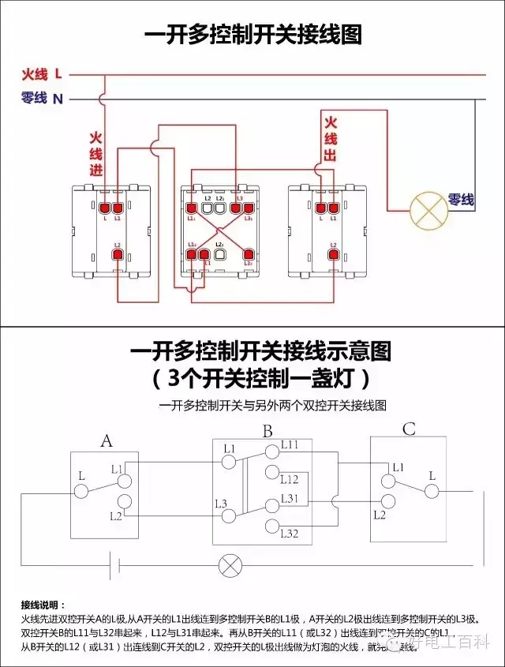

## 两开多控接线图

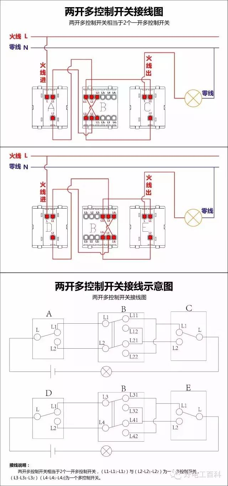

## 三开多控接线图

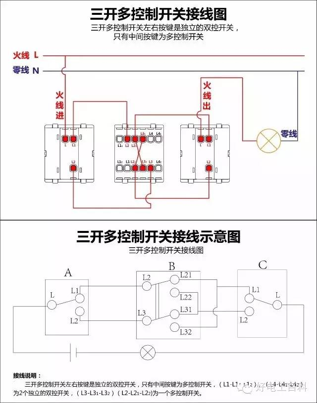