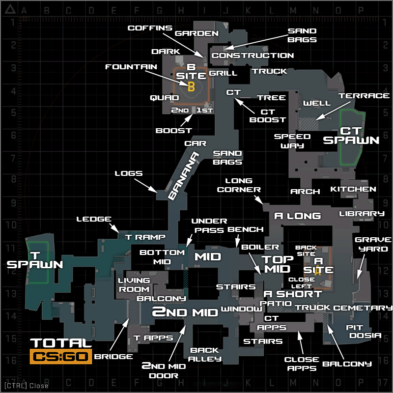
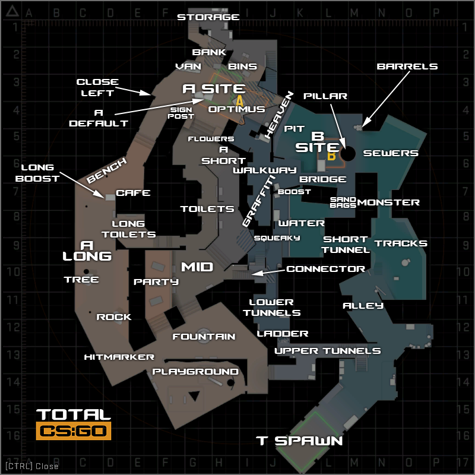
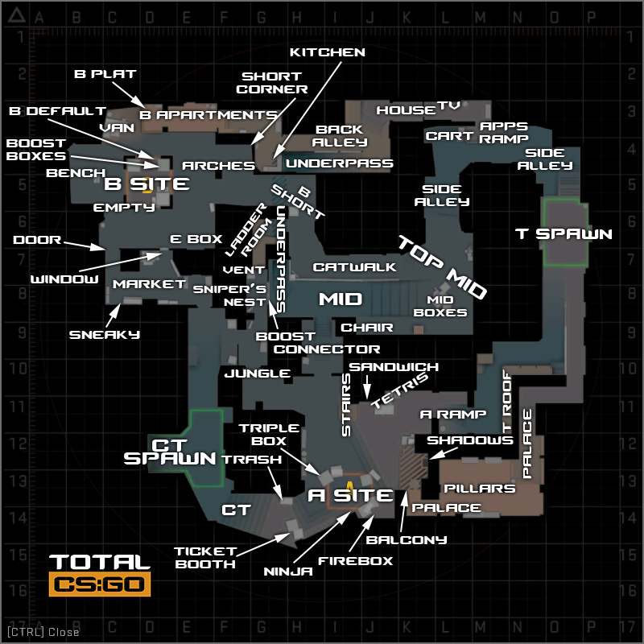
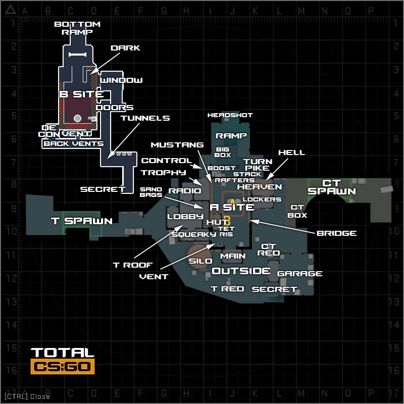
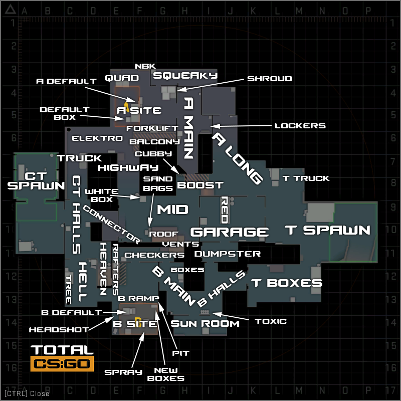

# CSGO Callouts of All Maps

[TOC]

## Train

### Overview

### Detail

| Callout Name   | Callout Description                                          |
| -------------- | ------------------------------------------------------------ |
| T Spawn        | The area where the Terrorists spawn, located in the top left of the map. |
| A Main         | The main entrance into A from T Spawn, which has a large opening that directly faces Blue Train. |
| T Stairs       | The stairway immediately to the right of T Spawn that runs upwards towards B Halls and ultimately the B bombsite. |
| Brown Halls    | The narrow corridor that connects the B Halls, that sits just outside the B bombsite with T Spawn and T Stairs. Brown stairs run parallel to Showers, and are separated by a wall. |
| Showers        | Located above T Connector/A Main are a set of Showers, that run parallel to the Brown Halls. |
| Popdog         | The small ladder located just before B Halls that leads down onto A Yard, just next to E Box. The ladder room itself and the area above are both referred to as Popdog generally. |
| B Halls        | The small area located directly behind the B bombsite that the Terrorists will often prepare executes from. These halls lead onto both Lower and Upper. |
| B Ramp         | One of the two entrances onto the B Site, B Ramp is the first that Ts will cross if coming from B Halls, and is the lower down of the two entrances. |
| Upper B        | One of two entrances onto the B Site, Upper B is the entrance that is raised much higer than Lower Ramp, and is further away from the T Spawn than Lower is. |
| Ladder         | This Ladder is located immediately to the left of exiting Upper B and coming onto Catwalk, and provides a safe way down onto the Site. |
| Spools         | A set of Spools on the B Site, opposite the bomb train, that players will often hide behind to give them an angle that can be deadly if left unchecked. |
| Catwalk        | The Catwalk comes immediately after Upper B, and is what players will cross onto upon moving through the archway from Upper to the bombsite. |
| Headshot       | Headshot is located at the very end of Catwalk on Upper B, where players can crouch down on a Spool to have only their head showing. |
| Bomb Train (B) | The train in the center of the B Site where the bomb can be planted on or around. |
| White          | The white train on B Site, located just outside of Lower B / B Ramp. |
| Yellow         | The yellow train on B Site, located behind Bomb Train.       |
| Red (B)        | The red train on B Site, located right next to Z Connector.  |
| Oil            | The black oil train on B Site, located right next to Headshot / Catwalk. |
| Sidewalk       | The platform that runs from Lower B / B Ramp up until Z Connector. |
| Z Connector    | The connector between the A and B bombsite.                  |
| CT Spawn       | The area of the map where the CTs spawn. This callout can also refer to the back of the B Site, as there are two doorways that are accessible from CT Spawn that players could be located at. |
| Back Site (B)  | The back of the B site, behind Oil and Red trains, that borders with CT Spawn. |
| CT Stairs      | The stairway that runs from CT Spawn towards Ivy.            |
| Old Bomb       | The train in the alleyway nearest to CT Spawn, that connects CT Stairs with the A Site. Named as it used to be the Bomb Train for A in previous iterations of the map. |
| A1             | The small alley that runs between Old Bomb and the wall, closest to the side of CT Spawn. |
| A2             | The small alley that runs between Old Bomb and the wall, closest to the side of Ivy. |
| A3             | The alley that leads out from Ivy onto the A Site / CT Tunnel. |
| CT Tunnel      | The back offices between Ivy, the CT Stairs and the A bombsite. It can be used by Ts who have taken control of Ivy to wrap through and attack the B Site from CT Spawn. |
| Ivy            | The long connector that leads from Alley to A3 and onwards to the A bombsite. Named Ivy for the Ivy that can be seen growing near to it. |
| Dumpster       | The dumpster outside of Ivy. This can be hidden behind or climbed on top of to provide an off-angle, so is an important call in the Ivy area. |
| Alley          | The long back-alley that leads from T Spawn all the way to Ivy. |
| Olof           | The small cubby next to Blue Train that faces A Main / T Con. Not to be confused with the cubby by Green Train which is called "Hell". |
| Sandwich       | The small gap between Blue and Green train at the top of the A Site. |
| Hell           | The small cubby next to Green Train that faces towards Ivy. Not to be confused with the cubby by Blue Train called "Olof". |
| Red (A)        | The Red Train on the A Site, located closer to the Bomb Train than Blue and Green. |
| Blue           | The Blue Train on the A Site, directly outside of A Main / T Con. |
| Green          | The Green Train on the A Site, directly outside of Ivy / A3. |
| E Box          | The Electric Box that stands between Popdog and the A Bomb Train. A common position to defend Popdog from. |
| Bomb Train (A) | The Bomb Train on A that the bomb can be planted on or around, located right next to Z Connector. |
| Heaven         | The skybox above the A Bombsite that can be reached with a ladder, and has expansive windows to see the majority of A from. |
| Cubby          | The small alcove where the ladder that leads up to Heaven is on the A Site. |
| Pigeons        | The region between Ivy and Alley.                            |
| Camera         | The wall on A Site between A3 and A2.                        |
| Kitchen        | The kitchen that lies between T Stairs and Showers.          |
| Summit         | The area between Bomb Train and White, where the player Summit1g famously was killed by his own molotov. |

## Dust 2

### Overview

### Detail

| Callout Name    | Callout Description                                          |
| --------------- | ------------------------------------------------------------ |
| A Short         | The walkway that connects mid to the A bombsite. It's typically used by Ts to rush on eco/pistol rounds, or to split A with another group of Ts pincering the site from A Long. |
| T Spawn         | The side of the map where the Terrorist side spawns. A small section of T spawn offers a view down mid to mid doors, giving Ts the chance to see which CTs cross over to B. |
| T Ramp          | This is the ramp that leads down from T Spawn to outside B Tunnels. The term genuinly refers to the ramp section only, rather than the raised platform, which is called T Platform. |
| T Plat          | This is the raised platform that leads from T Spawn to outside B Tunnels. It features several stacks of bricks that can be used to watch B Tunnels from a strong position. T Plat borders T Ramp. |
| Outside Tunnels | The area just outside of B Tunnels when approaching them from T Spawn. This is quite a broad, open area, so this callout covers quite a bit of space. |
| Upper B Tunnels | This is one of two sections of B Tunnels. It begins at the entrance to B Tunnels from T Spawn, and extends to the chokepoint that leads to the B bombsite. |
| Lower B Tunnels | This is one of two sections of B Tunnels. It begins at the stairs leading down from Upper Tunnels into the corridor that connects the Tunnels to mid, and ends at the archway into mid. |
| Close           | A loose callout, but this is generally what the left corner as you exit B Tunnels onto the B site as a Terrorist is referred to. It's a very close angle that, if left unchecked by the Terrorists, can be very deadly. |
| B Closet        | This is the corner of B Site where the car is located, to the right of Tunnels as you exit them or to the left of B doors. |
| B Car           | This is the car on B site to the right of Tunnels Exit and to the left of B doors if you enter from mid. This callout is only used if there's a player directly behind the car - if they're in the corner next to car then that is typically called Closet instead. |
| Fence           | This is the fenced off wall on B Site that can provide a hiding spot invisible to the Ts until they have moved from Tunnels onto B site. |
| B Plat          | This is the elevated area of the B bombsite next to where the bomb can be planted, and is directly opposite the exit of B Tunnels. |
| Back Plat       | This is the backend of B Plat. It has a seperate callout name as when you're on the bombsite you won't be able to see the back of B Plat, so this is used when a player is tucked right into the edge of the area. |
| Big Box         | This is the big box that resembles the Xbox in mid, that sits on B site. It is between B Plat and the bombsite. |
| Double Stack    | This callout refers to the two boxes that are stacked on top of each other in the middle of the B bombsite. These are not to be confused with the boxes that lead to B Window. |
| B Default Plant | Where the bomb is most commonly planted on the B Site. It hugs the brick wall, is just below B Window, and on the side of B Doors. |
| B Window        | This is the hole in the brick wall on the B site, that has several boxes serving as a platform to reach it as its raised off the ground. It's a common position to use when defending the B bombiste and retaking it. |
| B Back Site     | This is the back of the B bombsite, as if you were looking at it from the Tunnels Exit. It typically refers to the area behind all of the boxes on B, and borders with B Plat. |
| B Doors         | The double doors that lead into B from CT Mid.               |
| B Boxes         | This callout refers to the boxes between CT Mid and B Doors. They are often used as a vantage point to watch players attempting to come from mid to B. |
| Scaffolding     | This is the scaffolding (building materials) just outside B, on the side of B Window. They can be walked on to give a favorable angle to watch mid to B pushes from. |
| CT Mid          | This area refers to the space between B Site, Mid and CT Spawn. This area is behind mid doors, and sits next to CT Spawn. |
| Mid Doors       | The double doors in Mid.                                     |
| Close Mid Doors | The corner to the right of Mid Doors if you were going through them from Mid to CT Spawn. It is commonly called Hiko after the North American pro player pulled off an insane shot from the position. |
| Xbox            | The box in Mid, by the doors, that can be used to gain access onto Catwalk and A Short. It is opposite the exit from Lower B Tunnels. |
| Mid             | The middle area of the map, that extends from Mid Doors to the top of Mid. Generally the area of Mid that slopes is what will be called as "Mid". |
| Palm            | The now-telephone mast that sits near the top of mid next to Catwalk, where there was once a Palm Tree. |
| Right Side Mid  | The indented area of Mid that is on the right if you're looking from Mid Doors up towards T spawn. It has this callout as typically only CTs will be calling it, so therefore it is correct for their viewpoint. |
| Top Mid         | The top of Mid if you're looking from Mid Doors up towards T Spawn. This connects Suicide with Mid. |
| Suicide         | The pit that is used to jump down from T Spawn and run straight to Top Mid. It is directly opposite Mid Doors, and earned its name from being perilous at times to jump into due to potential AWPers. |
| Outside Long    | This is the open space outside of Long Doors on the T Spawn side of the map. It connects T Spawn to Long Doors and A Long. |
| Long Doors      | This area defines the two sets of Double Doors that lead from Outside Long to A Long. |
| Blue            | This is the large, blue shipping crate that stands opposite A Long Doors. |
| Side Pit        | This is the area of ground that is between Pit and A Long Doors. The differentiation between this area and Pit is when the ground starts to slope downwards, and the small brick wall before the Pit area. |
| Pit             | The sloped-down area that is outside of Long Doors and at the end of A Long. It faces opposite to the A Site but is a decline, so players can be in Pit but hidden from A Site. |
| Pit Plat        | The platform to the right of Pit if you're looking at it from the bottom of pit. It allows for some good sniping angles onto the A site. |
| A Long          | This is the space of ground that connects Long Doors and Pit to the A Bombsite. It is a long narrow stretch of ground. |
| Long Corner     | The corner of the closest building to Long Doors. It is a very common place for CTs to hold against pushes at A Long. |
| A Car           | The car that is tucked away to the right side of A Long if you're approaching from Pit. It can be used to watch A Short or A Long, and this call covers the general area around the car. |
| A Cross         | This is the open area that seperates A Long from A Site. It is wildly exposed to every angle - Site, CT Spawn, Short - which is why it's called "Cross." |
| A Ramp          | The ramp that leads upwards from A Cross to the A Bombsite.  |
| A Default Plant | The default plant spot on A. It is on the edge of the raised platform, as close to A Long as possible to provide the best visibiltiy from every angle to attack any CTs defusing. |
| Barrels         | The set of barrels that sit behind A Site, near the mesh fencing. |
| Goose           | The enclosed section behind A Site and Barrels that has the image of a goose spraypainted onto it. |
| Elevator        | One of the corners of the A Site Platform, closest to the side of CT Spawn. It earned its callout as it's a common position for CTs to boost teammates up onto the bombsite when retaking. |
| Short Boost     | The set of dumpsters right outside of CT Spawn on the A side. These can be used to boost CTs onto A Short faster than running there gets them. |
| A Platform      | The platform that the A bombsite is placed on. This is quick a broad callout, but generally refers to the area between the A Bombsite itself and A Short. |
| A Ninja         | A hidey-hole behind a stack of boxes on the A Short side of A that can be used to Ninja defuse by the CTs if the Ts all come from A Long and don't clear the position. |
| Stairs          | The set of stairs that connect Catwalk with A Short.         |
| Catwalk         | The walkway on the side of Mid that leads onto A Short and the A Bombsite. Generally this callout is defined by the start of the Catwalk at the top of Mid up until Short Stairs, where it transitions into A Short. |
| CT Spawn        | This is the location (technically under short) that the Counter-Terrorist team spawn within. |

## Inferno

### Overview

### Detail

| Callout Name             | Callout Description                                          |
| ------------------------ | ------------------------------------------------------------ |
| Banana                   | The narrow pathway leading from T Ramp and Bottom Mid up towards the B Site. |
| B Site                   | B Site is where the bomb can be planted on the B side of the map. |
| T Spawn                  | T Spawn is where the Terrorists spawn each round.            |
| Mid                      | The open, Middle area of the map, that provides access to the A side of the map from T Spawn. |
| Second Mid               | Second Mid is the smaller Mid on Inferno, and runs between T Apartments and directly opposite to Window and CT Apartments. |
| T Ramp                   | T Ramp is the ramp that leads up from T Spawn towards Mid, and has vision towards Top Mid which is where CTs will commonly hold. This is a common spot for AWP duels with CT AWPers in Mid. |
| Ledge                    | The small, elevated spot just behind T Ramp, that can provide a different angle to view Top Mid from. |
| Living Room              | The upstairs area in some of the apartments near T Spawn and T Apps. |
| Balcony                  | The Balcony that extends from Living Room and T Apps to give a good view of Second Mid / Apartments from. |
| Bridge                   | This is the Bridge that connects Living Room to the rest of T Apartments, and faces the Window area in CT Apartments. |
| A Short                  | A Short is the pathway towards A that passes by CT Apartments and Truck. |
| A Long                   | A Long is the pathway towards A that passes by Arch and Library. Gaining control of this area can be used to split B from CT Spawn. |
| T Apartments             | T Apartments is the structure of apartments that runs at the bottom side of Second Mid. |
| Second Mid Door          | The door that leads out of T Apps and into Second Mid / Alt Mid. |
| Back Alley               | The final stretch of T Apartments that connects it to just outside of the Stairs section of CT Apartments. |
| Underpass                | Underpass is the small, underground area that connects Mid with Second Mid, and requires players to crouch at times as they pass through. |
| Bench                    | The Bench to the side of mid, that is located directly opposite the crossover from Second Mid to Mid. |
| Second Mid Stairs        | These are the stairs located just underneath Window in CT Apartments, and are located right at the top of Second Mid. |
| CT Apartments            | The main set of Apartments on Inferno, and the ones people will generally be referring to when they say "Apps" or "Apartments." |
| Top Mid                  | The side of Mid that the CTs hold by default. This can refer to players pushing up the chokepoint of Mid just before it seperates into Short side and Arch side, as well in the space between both sides of Mid where CTs will commonly hold. |
| Pit                      | The lowered-down area on the A Bombsite that sits below the Balcony and CT Apps. It is a very common area to defend the A Site from for the CTs. |
| Boiler                   | The doorway from CT Apartments from Top Mid. It is located slightly towards A Short. |
| Window                   | The large, exposed Window at the front of CT Apartment that overlooks Second Mid. It provides good vision to Second Mid, but is very open. |
| Stairs                   | The stairway in CT Apartments that connects Second Mid to CT Apps. This is close range combat at its finest, so bring your Mag-7! |
| Close Apartments         | The hallway along CT Apartments that opens up onto the Balcony above Pit, and is what the Ts will commonly pass through if they're attacking A from Apps. |
| Balcony                  | The Balcony that sits above Pit on the A Bombsite right next to the exit of CT Apps. |
| Dosia                    | The very bottom right hand corner of Pit. Named after the grenade that the pro player Dosia threw to weaken two of the opposite team to ensure the bomb would kill them when it exploded. |
| Cemetery                 | The stone wall at the back of Pit that faces directly from Balcony when exiting CT Apps. |
| Graveyard                | Graveyard is the graveyard towards the back of the A Site, where players can hide with the right positioning to maek themselves very difficult to spot behind the walls at the graveyard's entrance. |
| Truck                    | The Truck next to A Short on the A Site, that is used to jump on to gain access to Balcony and CT Apps. |
| Patio                    | The small, porched-off section of A Short that looks directly onto Top Mid, and will be a common place for CTs to setup a crossfire in Mid. |
| Long Corner              | The corner that is tucked away in A Long to the far side opposite Library, and usually requires a molotov to clear out. |
| Library                  | The Library that sits just outside of the A Site and is directly accessable from CT Spawn. |
| Kitchen                  | The Kitchen that is next to Library, closer to CT Spawn than it is A. |
| A Site                   | A Site is where the bomb can be planted on A.                |
| Close Left               | The box to the immediate close-left of A when approaching from Short / Truck Side. |
| Back Site (A)            | The far-side of the A Bombsite when approaching from Short / Truck Side. |
| Arch                     | The Archway that leads from A Long towards Speedway, CT Spawn and ultimately the B Site. |
| CT Spawn                 | The location that the CTs spawn every round.                 |
| Speedway                 | The walkway that runs from Arch all the way to outside B and next to Construction. |
| Terrace                  | The flowery Terrace next to CT Spawn, that overlooks Well and Speedway. |
| Well                     | The Well located near CT Spawn as you move from it to the B Site. |
| Truck                    | The Truck that stands just outside of Construction, near the B Site. |
| CT                       | This callout doesn't refer to CT Spawn, rather the exposed area the Ts will need to smoke off when attacking the B Site, otherwise they risk getting shot at from near CT Spawn. |
| Tree                     | The dark corner that is located directly opposite the exit to Construction, nearest CT Spawn. |
| CT Boost                 | This is the very powerful boost position near CT on B Site that can give players a view of the Site even when CT has been smoked off. |
| Construction             | Construction is a large, ruinous area of the map just outside of B. |
| Sand Bags (Construction) | The set of Sand Bags located at the back of Construction that can be hidden behind by players. |
| Garden                   | The green, flowery area that is immediately outside of Construction when exiting towards the B Site. |
| Coffins                  | The set of Coffins at the back of the B Site that can provide a good headshot positon to defend from. |
| Grill                    | The grill that is placed just outside of the B Bombsite, and can be planted near. |
| Dark                     | This is the shadowy corner located right at the back of the B Site that can be hidden in by defending players. |
| Fountain                 | The water Fountain located right in the middle of the B Site. |
| Quad                     | The stack of boxes at the back of B Site that can be a strong position to hold and duke players around. |
| 2nd                      | The little cubby that players can hide in next to a set of boxes on the B Site. This is closest to Quad, and faces Fountain. |
| 1st                      | The little cubby between two sets of boxes, immediately to the left of the B Site when attacking from Banana. |
| Boost                    | The boosted spot that is right next to 1st on the B Site, and can give good vision towards players pushing from Banana. |
| Sand Bags (B)            | These are the Sand Bags on Banana, that can be very treacherous at hiding players and will usually be molotov'd out. |
| Car                      | The Car that is located at the very top of Banana.           |
| Logs                     | The small cubby at the bottom of Banana with sets of logs located in the space. |
| Bottom Mid               | The side of Mid closest to T Spawn, right around where Underpass comes out onto. |

## Overpass

### Overview

### Detail

| Callout Name      | Callout Description                                          |
| ----------------- | ------------------------------------------------------------ |
| A Site            | The area in which the bomb can be planted on the A bombsite. |
| B Site            | The B Bombsite. This call refers to people directly on the wooden platform that the bomb can be planted on. |
| T Spawn           | The bottom of the map where the Terrorists spawn.            |
| A Long            | The Long park area that leads all the way from Mid / Fountain area to the A Bombsite. An AWPers paradise. |
| Upper Tunnels     | The portion of the tunnels that connect T Spawn to the Mid area outside A. These connect to Lower Tunnels which lead through to Connector. |
| Lower Tunnels     | The portion of tunnels that lead from Upper Tunnels to Connector, accessed by dropping down a ladder from Upper Tunnels. |
| Connector         | The Connector that leads from Lower Tunnels up to outside Toilets on the A side of the map. |
| Party             | The platform next to Toilets that is decorated with picnic benches and balloons. |
| Mid               | The area of the map next to Toilets, Party and the exit of Connector. Crossing from Fountain to Toilets brings you through Mid. |
| Fountain          | The area around the Fountain that is found just before Mid on the A side of the map. |
| Playground        | The fenced-off Playground area, behind Fountain and directly opposite the exit of Upper Tunnels when approaching A from T Spawn. |
| Rock              | This Rock is located on A Long, and is the first thing an enemy could be hiding behind when pushing Long as a T. |
| Tree              | The Tree is located to the left of A Long, close to the Long Toilets area, and can be hidden behind by players to make them invisible when an enemy first checks Long from Playground side. The Tree can be wallbanged. |
| Long Toilets      | The side of Toilets that protrudes out onto A Long.          |
| Long Boost        | The flowerbed that can be boosted up onto, or reached with a skillful jump from the bench next to it. It provides good vision onto the A Site and can catch CT players off guard. |
| Close Left (Long) | The small corner next to the exit of A Long onto the A Site that can be hidden behind. Maybe this doesn't count as a callout, but it's worth knowing! |
| Van               | The Van located at the back of the A Bombsite, right next to Bank. |
| Bank              | The Bank callout refers to the Bank at the back of the A Bombsite, which has an exit that gives vision over much of the A Bombsite and is right next to a dumpster for cover. |
| Default (A)       | The default plant spot on the A Bombsite, which is just between the two green boxes opposite the entrance to the site when coming from Mid. |
| Optimus           | The truck to the right side of the A Site when approaching from Mid or A Long. |
| Bins              | The Bins at the back of the A Bombsite that connect to Snipers and B. These come out right to a dumpster, so you may hear that call also. |
| Toilets           | The long set of Toilets / Restrooms that run from Mid all the way to the entrance of A. |
| A Short           | This is located right by the entrance to the A Site where Mid tails off and turns into A Short, coming right to the stairs that mark the entrance onto A. |
| Flowers           | The flowerbed located to the left of Toilets as you approach the A Bombsite. Can be headcamped by players so a useful call to know. |
| CT                | A different call to most maps, as this doesn't usually refer to the CT Spawn, which is on the A Bombsite. This call usually points to there being players at the back of A, in the stairwalls and tunnels that snake between Snipers, Stairs and Bank. |
| Monster           | The tunnel that leads directly into B from T Spawn.          |
| Tracks            | The area outside of the Monster tunnel that provides routes to both Monster and Short Tunnel. |
| Short Tunnel      | The tunnel that leads towards Construction / Water.          |
| Water             | The water-logged area that is next to B Short, Connector and Short Tunnel. |
| Squeaky           | The door at the end of Connector that leads onto Construction / Water. |
| B Short           | The entrance onto the B Site coming from Construction / Water. It enters directly onto the Site and features a set of sandbags on it. |
| Sandbags          | The set of sandbags located on B Short. They will commonly be hidden behind by players, so is a call you'll probably hear often. |
| Sewers            | The area you will come out onto if you approach the B Site from Monster. |
| Pillar            | The large, circular Pillar that sits on the center of the B Site. |
| Toxic Barrels     | A set of barrels at the side of the B Site that can give an excellent angle on people exiting Monster. |
| Pit               | The dark area behind the B Bombsite that is covered in water. Dropping onto the Site from Heaven will have you landing in Pit. |
| Heaven            | The raised metal platform that provides a complete vantage point to watch B from. |
| Graffiti          | The small, boxed off corner at the back of B. Players can be boosted from here to give them a viewpoint of Construction / Water. |
| Cafe              | The cafe sign opposite bench, on the other side of the wall to Long Toilets. |
| Bench             | The bench opposite Cafe.                                     |
| Storage           | The room between Bank and Stairs near A Site.                |
| Bridge            | The stretch of concrete next to B Site that takes you from Sandbags to Walkway. |
| Boost             | The spot at which players can boost from Water to see onto B Site. |
| Ladder            | The ladder that takes you from Upper Tunnels to Lower Tunnels. |
| Signpost          | The signpost near A Site, on the wall that spans between the exits to A Long and A Short. |
| Hitmarker         | Hitmarker is located just at the start of A Long, right as Terrorists expose themselves to A Long for the first time. It is named "Hitmarker" as often AWP shots will clip players through the wall that stands by this area, dealing them heavy damage but not killing them. |

## Mirage

### Overview

### Detail

| Callout Name  | Callout Description                                          |
| ------------- | ------------------------------------------------------------ |
| Mid           | The open, expansive Middle section of the map. Sniper's Nest has a complete view of Mid, as does Top Mid where the Terrorists enter the area from. |
| B Site        | B Site refers to the location on B at which you can plant the bomb. |
| A Site        | The A Bombsite. Typically this callout just refers to the sector of the Site where the bomb can actually be planted, as the other areas all have their own callouts. |
| T Spawn       | The area of the map where the Terrorists spawn.              |
| T Roof        | The raised ledge outside of A Ramp, closest to T Spawn, that is often used by the Ts to wait for pushes through A Ramp or to line up smoke grenades for the A Bombsite. |
| A Ramp        | The primary entrance onto the A Site from T Spawn. Recognizable from it's arched entrance/exit. |
| Palace        | The building that can be used to enter A from T Spawn. It's typically used to pincer the A Site in conjuction with A Ramp. |
| Pillars       | These are the Pillars inside of Palace that can be used to duck and hide behind. |
| Balcony       | The wooden balcony that extends from Palace to give a wide view of the A Site. The callout for anyone underneath this balcony is "Shadows". |
| Shadows       | The small area underneath the Balcony by Palace. It is pitched in darkness, which is why it's called Shadows. Use this callout to refer to someone underneath the balcony, and "Balcony" to refer to someone on top of it. |
| Tetris        | The stack of boxes and square stone clusters just in front of A Ramp. This callout refers to anyone on these boxes - whether they're tucked behind the wall and not visible from A Site or if they're fully exposed. |
| Sandwich      | The small alcove between Stairs and Tetris next to the A Bombsite. |
| Stairs        | The set of stairs on the A Bombsite next to Connector and Jungle. This can be used to give a good vantage point for the CTs to defend the A Site from. |
| Firebox       | The small cubby on A Site that players can hide behind in the hopes they aren't checked by the opposing team. Named due to the fact that it is most commonly cleared by an easy-to-throw molotov or incendiary. |
| Ninja         | A small alcove between two stacks of boxes on the A Bombsite that is often left unchecked if the Terrorists don't attack the Site from Mid. |
| CT            | This callout is similar to CT Spawn, but most generally covers the entrance to the A Bombsite from CT Spawn, next to Ticket Booth and Trash. As this is frequently used as a position to defend the A Site from, it needs its own callout from CT Spawn. So when referring to the position you can watch the A Site from, use the callout "CT". Sometimes you'll hear CT Spawn and CT be interchanged to refer to either where the CTs actually spawn, and the defensive position on A by Ticket Booth. |
| Ticket Booth  | The tall, grey column by CT Spawn that faces the A Bombsite. This can be jumped onto to see over smoke grenades, and is a favorite spot for a lot of AWPers. |
| Trash         | The trash can on the other side of CT Spawn, facing the A Bombsite, to Ticket Booth. This can be jumped on top of, which will hide the player's body from anyone on A unless they purposefully check it. |
| CT Spawn      | The area where the CTs spawn each round. Sometimes you'll hear CT Spawn and CT be interchanged to refer to either where the CTs actually spawn, and the defensive position on A by Ticket Booth. |
| Jungle        | The spot of ground away from Sniper's Nest and Connector that gives a player vision onto A. |
| Connector     | The short tunnel that connects Mid to the A Site. It's entrance on the A side leads straight to Stairs on the left, the A Bombsite straight ahead and Jungle on the right. |
| Vent          | The small hole connecting CT Spawn with Mid Window. At the start of each round it will have metal strips covering the hole that you'll need to shoot or stab to clear your entryway. |
| Sniper's Nest | The large, rectangular window that has a complete view of Mid, and is directly opposite Mid Boxes on the far end. Named after being a great place to snipe from as a CT. |
| Ladder Room   | The small room that connects B Short with Sniper's Nest and Jungle via a short vent. It has a ladder in it that can be used to climb up to infiltrate Sniper's Nest. |
| Underpass     | The underground passage that leads from B Apartments to the bottom of Mid, right underneath Sniper's Nest. |
| Boost         | A set of ledges right in the corner of mid, right underneath Sniper's Nest and opposite Underpass, that can be used by players in Mid to boost each other into Sniper's Nest. |
| Chair         | The small chair tucked into one of the corners in Mid.       |
| Top Mid       | A vague call, but this refers to the area of Mid furthest away from Sniper's Nest. It covers the entrance to Mid from T Spawn, Mid Boxes and the area around this. |
| Mid Boxes     | The set of boxes and a cart at the top of Mid. Generally the area the Ts will hide behind as they attempt to take Mid. |
| Default       | The set of boxes around the default plant area on the A Bombsite. These have a large piece of wood on them with the letter "A" painted on. |
| Triple Box    | The triple set of boxes at the back of the A Bombsite, nearer to CT Spawn than the default plant boxes. |
| Catwalk       | The catwalk in Mid that leads up to B Short. This can be switched out with the "B Short" callout, but typically refers to the section of the Catwalk visible to Mid. |
| B Short       | The entrance onto the B Site from Mid, leading on from Catwalk. |
| Short Corner  | The corner to the right of B Short if you're coming to the B Site from Mid. This is next to the wallbang-able spot of B Apartments. |
| Market        | The small shop that is next to the B Site, connecting T Spawn to the bombsite. |
| Window        | The singular window in Market that overlooks the B Site. This has a wooden panel blocking half the view at the start of each round that must be shot or stabbed to be removed. |
| Door          | The doorway into Market on the side closet to the B Site.    |
| Bench         | The bench at the back of the B Bombsite attached to a small brick wall. |
| Van           | The white truck that stands opposite B Apartments, and be jumped onto for access to B Apps / to gain vision into them. Also known as Van, and sometimes Car. |
| B Apartments  | The long, narrow corridor on the way to the B Bombsite from T Spawn. This is the chokepoint that the Ts will most frequently attack the B Site from. |
| Kitchen       | The kitchen area just outside B Apartments. This area can be wallbanged through a small wooden window that makes up part of the wall. |
| B Plat        | The platform that leads out onto B Site.                     |
| Side Alley    | The area between Mid and T Spawn.                            |
| TV            | The TV in House/B Apartments.                                |
| Cart          | The boxes that can be jumped on to access the Apartments/House ramp. These were previously a cart, hence the name. |
| Apps Ramp     | The ramp that leads up to B Apartments from T Spawn.         |
| Arches        | The arches between B Short and B Site.                       |
| Sneaky        | Sneaky is the position on top of the fridge up against the wall in Market. |
| Empty         | Empty is the pillar closest to the Market Door.              |
| E Box         | E Box is in the corner of B Site closest to Market Window.   |
| Boost Boxes   | Boost boxes are the boxes next to default on B that players can be boosted on top of. |
| House         | House is the building that connects Back Alley/T Apartments to T Spawn/Side Alley. |
| Back Alley    | Back Alley refers to the area of the map between Apartments and House/TV. |

## Nuke

### Overview

### Detail

| Callout Name | Callout Description                                          |
| ------------ | ------------------------------------------------------------ |
| T Spawn      | This is the area that the terrorist team spawns in.          |
| CT Spawn     | The location that the counter-terrorist team players spawn within. |
| Outside      | The area between Silo, Garage, Secret and A Main.            |
| A Site       | The region in which the bomb can be planted at A.            |
| B Site       | The area that the bomb can be planted within on B.           |
| Garage       | The large warehouse near CT Spawn, and next to Secret. Commonly CT AWPers will play here, watching Silo. |
| Ramp         | The ramp that leads down to B Site, and the region/room surrounding it. |
| CT Box       | The box near CT spawn and close to the stairs that lead from CT Spawn. |
| T Roof       | The roof above Lobby. You can access this roof from a ladder near T Spawn. When on this roof, you can access Silo. |
| Lobby        | The closest room to T Spawn, that is surrounded by Sandbags (essentially A Site), Squeaky, and Radio. |
| Radio        | The room in between Lobby and Trophy, which was sign posted as Radio in the old Nuke map. It now has vending machines in it. |
| Trophy       | The room with trophies in it, next to Radio and Control.     |
| Control      | The room that leads on to Ramp from Trophy.                  |
| Squeaky      | The area just off Lobby that has a squeaky door that leads on to A Site. |
| Vent         | Vent refers to any area inside the vent system that connects A Site, Secret, and B Site together. |
| Hell         | Hell is the area under Heaven, near T Spawn and next to Turn Pike and Locker. |
| Heaven       | Heaven is the raised area that looks out onto A Site, it can be accessed via the ladder in Hell. |
| Lockers      | The Locker Room that has a window in it looking out onto Garage and CT Red. It is next to Hell. |
| Headshot     | The box at the back of ramp, a common spot for CTs to AWP.   |
| Sandbags     | The sand bags between Lobby and Hut.                         |
| Hut          | Hut refers to the metal hut on A Site, that connects Lobby to A Site. A common spot for CTs to molly to prevent rushes from the terrorist team. |
| Tetris       | Tetris refers to the boxes in front of Hut.                  |
| Mustang      | Mustang refers to the raised area next to rafters and above the entrance/exit to Hut from A Site. |
| Rafters      | Rafters refers to the raised area that is connected to Heaven and Rafters - it essentially runs along the back wall of A Site. |
| Bridge       | Bridge is the Bridge that connects Rafters to Mustang.       |
| Turn Pike    | Turn Pike is the room between Ramp and Hell.                 |
| Stack        | Stack refers to the boxes in the Turn Pike-side corner of Ramp. |
| Boost        | Boost refers to the Boxes next to the entrance to Ramp from Control. |
| Big Box      | Big Box is the area around and on the Big Box just above the ramp that leads to B Site. |
| T Red        | T Red refers to the red shipping container in Outside, located close to Silo. |
| CT Red       | CT Red refers to the red shipping container at Outside, located close to Garage. |
| Main         | Main is the room that connects A Site to Outside.            |
| Window       | Window is the room with a large (smashable) window that looks out onto B Site. |
| Dark         | Dark refers to the corner next to the stairs on B Site. It is named Dark because, well, it's pretty dark! |
| Decon        | Decon is the room with the single door that connects Back Vents/Tunnel to B Site (not the double doors). |
| Back Vents   | Back Vents refers to the region between Decon and Tunnel, that Vents leads out on to. |
| Tunnels      | Tunnels refers to any tunnel at B not covered by the Secret, Back Vents, or Window callouts - essentially the region between these areas. |
| Doors        | Doors refers to the double doors that lead from Tunnels/Window onto B Site. |
| Bottom Ramp  | Bottom Ramp is the lower part of ramp.                       |
| Silo         | The large Silo that can be accessed from T Roof and overlooks Outside. |
| Secret       | The staircase that leads from Outside to Tunnels.            |

## Cache

### Overview

### Detail

| Callout Name  | Callout Description                                          |
| ------------- | ------------------------------------------------------------ |
| Mid           | Mid refers to the "middle" section of the map and covers the land that joins Garage, Connector, and Highway. |
| A Site        | A Site is the entire region between quad down to Catwalk, A Main and Forklift. |
| T Spawn       | This is the area that the players on the terrorist team spawn in. |
| A Long        | A Long spans from the A side of Garage and T Spawn, all the way up to Squeaky Room. |
| Squeaky       | Squeaky is the room with the blue squeaky door that leads on to A Site. It is also the name of the door itself. If someone is on A Site pressed up against the door (not in squeaky room, the other side), some players will call Squeaky, rather than A Site, as it is more precise. |
| Shroud        | Shroud, also known as Boost Boxes, are the boxes in the corner of A Site, located between Squeaky and A Main. They are known as Boost Boxes as they can only be accessed by getting a boost from a teammate (or jumping from the top of squeaky door). |
| NBK           | NBK is the corner of A Site between squeaky door and quad. It is named NBK because the pro player named NBK made an impressive play from this location. |
| Quad          | Quad is the name given to the location that surrounds the big stack of four boxes at the back of A Site. Quad refers mainly to the location behind these boxes (most of which isn't visible from A Main and Catwalk), but can also refer to the area in front of the boxes. |
| A Default     | Default is the "default" plant spot, which is considered the safest place to plant as it is hardest to reach from most angles. |
| Forklift      | Forklift is the location around and behind (under balcony) the forklift vehicle located on A Site. |
| Balcony       | Balcony is the raised metal balcony on A site, located above Forklift, and stretching round to catwalk. |
| Highway       | Highway is the name given to the fairly narrow stretch of hill that connects Mid to A Site. |
| Default Box   | Default Box refers to the boxes located on A Site, next to the red shipping container. |
| Truck         | Truck refers to the area on and surrounding the truck located between Elektro and CT Hall. |
| CT Halls      | The CT Halls callout spans a large area compared to other callouts for this map - it refers to the area between Truck and Hell. |
| CT Connector  | CT Connector refers to the room that connects Mid to CT Hall/CT Spawn. A common spot for AWPers on CT at the start of the round. |
| White Box     | White Box refers to the area around and on the white box at the end (mid-side) of Highway. |
| Sand Bags     | Sand bags refers to the area around and on top of the sand bags between Connector and Mid Roof. |
| Mid Roof      | Mid Roof refers to anywhere on top of (on the roof of) the building between Vents and Sand Bags. |
| Vents         | Vents refers to the location around and inside the vents that connect Mid to B Checkers. |
| Cubby         | Cubby refers to the corner directly below boost that presses up against A Main. |
| Boost         | Boost is the roof on the T-Side of mid (opposite Vents) that can only be accessed by jumping on a teammate's head ("boosting"), or by successfully making a tricky jump/strafe from mid. |
| Checkers      | Checkers refers to the room with the checkered floor that Vents leads into, and is also connected to B Main, and the B Site area. |
| Back Checkers | Back Checkers refers to the area behind the boxes at the back of Checkers. |
| Garage        | Garage refers to the large Garage building that sits between T Spawn and Mid. It also connects to Dumpster. |
| T Red         | Red refers to the area on top of the red shipping container inside Garage. |
| Dumpster      | Dumpster refers to the room that connects Garage to B Halls. |
| B Halls       | B Halls refers to the area (inside the building) between B Main, Sun Room, Dumpster, and the exit to T Spawn. |
| B Main        | B Main refers to the area between B Site, Checkers and B Halls, but some players also refer to B Hall as B Main. |
| B Main Boxes  | B Main Boxes refers to the boxes close to where B Main leads on to Checkers, that CTs will often hide behind. |
| Sun Room      | Sun Room refers to the room containing a painting of a sun, that you access from B Halls. |
| Toxic         | Toxic refers to the yellow barrel close to the back of Sun Room. |
| B Offen       | B Offen is a less-commonly used call, but refers to the area between B Site and Hell, Checkers, and B Halls. |
| Pit           | Pit refers to the dip next to the ramp on B Site.            |
| B Ramp        | B Ramp refers to the ramp leading onto B Site.               |
| Headshot      | Headshot is the lower area on the Hell/Heaven side of B Site. It has this name because when a player is crouched there, you can only see their head. |
| B Site        | B Site is the area that the bomb can be planted within on the B bombsite (i.e. the entire raised area). Some players will refer to B Offen as B Site as well. |
| B Default     | B Default is the safest/most common plant spot, just behind the boxes to the front of the bombsite (Hell/Heaven side). |
| New Boxes     | This callout is for the area behind the tall gray boxes on the B Hall side of B Site. |
| Spray         | This refers to the area behind the boxes at the back of B Site. Also known as Back Site, and Back Boxes. |
| Close Left    | Close Left is the close left corner of B Site if you were entering from Hell (CT side). Terrorists will commonly hide here after a bomb plant to surprise CTs when they are retaking the site. |
| Heaven        | Heaven is the wooden ramp and platform that lead on from CT Hall to B Site/B Offen. |
| Blue          | Blue is the area (next to the blue wall) under Rafters/Heaven. |
| Rafters       | Rafters is the raised metal platform that Heaven leads on to. Some players will call this Heaven. |
| Tree          | Tree refers to the large tree located at the back of Hell. It is possible to get up onto the raised platform that the tree grows out of. |
| CT Spawn      | CT Spawn refers to the area that the counter-terrorist team spawn in. |
| T Truck       | Truck is the area around (usually behind) the truck located between T Spawn and T/A Long. |
| T Boxes       | T Boxes is the area between B Halls and T Spawn.             |
| Flash Window  | Flash Window is the window that grenades can be thrown from Sun Room to B Site from. |
| A Main        | A Main is the building that connects A Long/T Spawn to B Site. |
| Lockers       | Lockers refers to the section of A Main (that can be seen from A Site) with lockers inside. |
| Elektro       | Elektro is the area between Truck, A Site, and Highway.      |