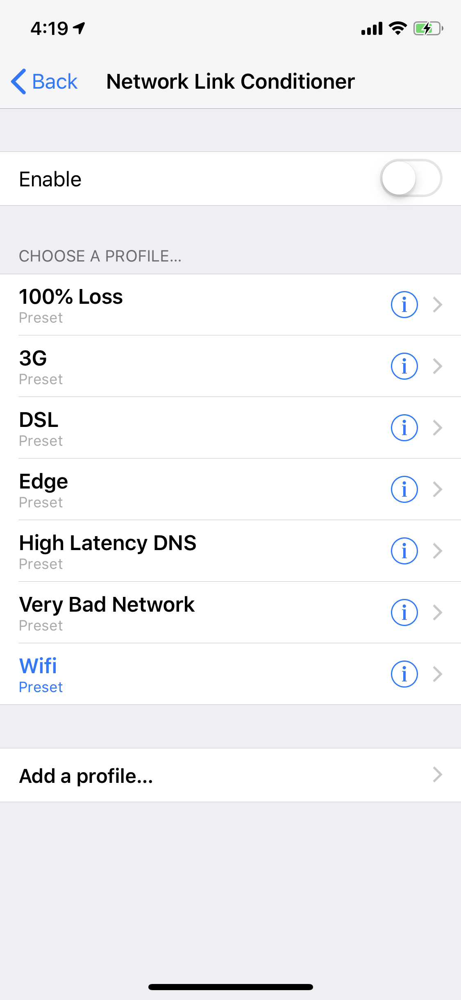
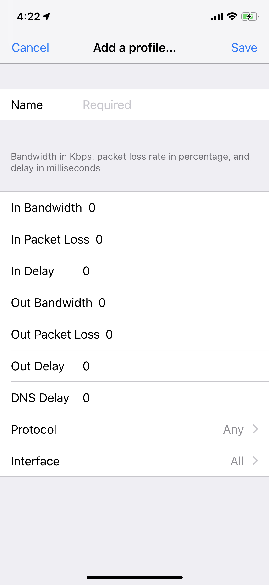

<!-- START doctoc generated TOC please keep comment here to allow auto update -->
<!-- DON'T EDIT THIS SECTION, INSTEAD RE-RUN doctoc TO UPDATE -->
**Table of Contents**

- [Network Link Conditioner](#network-link-conditioner)
  - [更新](#更新)
  - [位置](#位置)
  - [作用](#作用)
  - [怎么用](#怎么用)

<!-- END doctoc generated TOC please keep comment here to allow auto update -->

[TOC]

# Network Link Conditioner

网络连接调节器(调试/测试用)

## 更新

Xcode 11 已经在设备项内置了这个功能, 比在手机上设置要更加方便. 

> 同时也增加了设备过热降频测试条件调节器

## 位置

 `General - Developer`

## 作用

对于广大 iOS 开发者而言, 网络测试是必要的, 无论是做`缓存`还是网络条件判断功能. 而我们的机器普遍都会连接 WiFi, 所以我们如果想模拟

- 3G

- DSL

- Edge(2G)

- DNS 挂 X 的情况

- 自定义

  

很多都是默认在功能开启时 Apple 预设的, 当然我们可以自定义.

## 怎么用

已经这么明显了. 也不用我在这献丑了🎉

