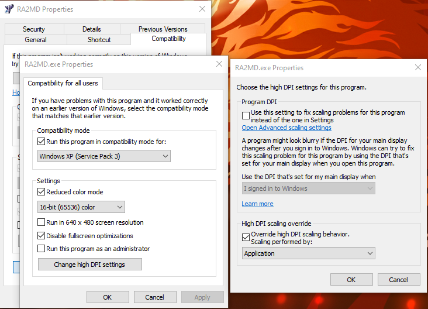

[TOC]

# Origin红警2（含尤里的复仇）的Win10补丁和汉化（简体中文版）- Win10 黑屏补丁

## 🧻 下载所需文件复制并替换 *不需要全部都下载, 按需即可* 

- [最新 ddraw.dll](https://github.com/CnCNet/ts-ddraw/releases/)
- [游戏黑屏补丁(针对显卡渲染, 包含了 ddraw.dll)](RA2_Win10/仅Win10补丁不含汉化.zip)
- [简体汉化资源文件 - RA2](RA2_Win10/RA2汉化.zip)
- [简体汉化资源文件 - Yuri's Revenge](RA2_Win10/尤里的复仇汉化.zip)
- [DX 的 3D 渲染关闭与开启的注册表文件](RA2_Win10/黑屏备用.zip)

## 🔧 修改 exe 可执行程序的兼容性属性

就是这 5 个货!

分别打开没一个程序的兼容性设置, 修改如下选项

- Compatibiity mode - **XP SP3**
- Reduced color mode - **16-bit**
- Disable fullscreen optiomizations
- Change high DPI settings - **Override high DPI scaling behavior, Scaling performed by: Application**

## 🎉 完结撒花

终于!!!👏

- 可以切屏
- 不卡顿
- 不黑屏
- 点击选项不卡死
- 支持高分辨率

> 小瑕疵：主界面切屏会丢失按钮名称（遭遇战界面切屏不会丢失按钮，但是点击遭遇战进入后会丢失界面），可以点击。并且点一下就恢复正常（推荐点击最底部的按钮）

## PS：⚠️

1. 补丁中的黑屏备用请看食用说明，不要随意使用。

2. 测试中独显1080TI不用替换应用程序运行也不卡顿，核显在运行尤里的复仇会卡顿 

>  本文内容经过整理, 部分参考原始作者：[鲁汀LT](https://www.bilibili.com/read/cv357537)

## 后记: 补丁中的应用程序是原版程序，使用了改渲染的工具修改了红警的渲染方式，

取自国外大神 原链接：http://www.stuffhost.de/files/cnc/CnCPatcher.html

下面是[备份补丁](RA2_Win10/CnCGraphicsPatch.zip)以及内容.

# Command & Conquer Graphics Patcher

Command & Conquer Graphics Patcher is a tool to make rendering in Tiberian Sun, Red Alert 2 and Yuri's Revenge faster.

## Which games can be patched?

This works for the latest patched versions, whether they are English or German. Tiberian Sun uses a packed exe, in which I couldn't locate the spot to change. If you have an unpacked exe (like from a NoCD-Patch), this should work, too. I didn't test any other language version.

At the time of release, this project was merely a day old, so if anything does not work, send me a message. This patch is designed to improve rendering in Windows Vista and later. It might not have an effect on earlier versions of Windows, or it might even have a negative impact. This patch is also stupid, because it does not automatically distiguish between OS versions to select the best behavior. Sorry for that, but I won't change it.

Testing showed this patch is working even with mods like Twisted Insurrection for Tiberian Sun and Mental Omega 2.0psi (which is using NPatch). So chances are good it is working for other mods, too.

## How to use

**Download** the patcher and either put in in the same directory as the game or put the game.exe/gamemd.exe file in the same folder as this patcher and run it. The patch is not applied until you apply it explicitly, and it can be undone again using the patcher.

To prevent issues with Windows Vista or later, I recommend to put the patcher into a separate folder and copy the game file into it. Copy it back after patching. Also: Back up your original game file, just to be sure.

You will need the Microsoft .net Framework 3.5 to run this tool. After all files are patched, this patcher is not needed any more.

## Background

The dimetric Command & Conquer games use several temporary graphics to draw to. Some of them are allocated in Video RAM, some of them are allocated in system RAM. When the game wants to draw something, the data has to be copied from VRAM to system RAM, which is an expensive operation and it gets more obvious the more objects (units, debris, ...) are on the map. The patch changes the game to not allocate surfaces in VRAM in the first place, so this cannot become an issue.

The following bytes need to be changed. This is not optimized. If you understand the raw assembler instructions, you can optimize it by putting a `jmp` there.

| Game           | Offset   | Original    | Patched     |
| -------------- | -------- | ----------- | ----------- |
| Tiberian Sun   | 0008AC2F | 3C 01 75 0C | 90 90 90 90 |
| Red Alert 2    | 000AA51F | 3C 01 75 0C | 90 90 90 90 |
| Yuri's Revenge | 000BA61F | 3C 01 75 0A | 90 90 90 90 |

## Credits

The patches solve the problem the same way as it is done by Ares, the Yuri's Revenge expansion dll. The original fix was implemented by DCoder. I applied this solution to TS and RA2 and coded the patching tool around it.

> CnCPatcher © AlexB 2012. Last updated: 2012-06-16.
